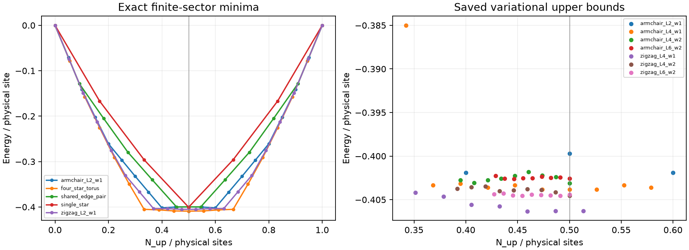

# Bounded physics extraction: exact microscopic WXY model

Analysis date: 2026-10-07; salvage continuation reuses source revision `1013e4f`. Original source revision: `0cf8270ddab456b9487c360e5fcaed281baadf44`, with pre-existing scientific outputs preserved. This extraction finished within the 48-hour budget, using measurements and small exact symmetry-block calculations rather than new production optimizations. Energies use J=1; entropies use natural logarithms. Hamiltonian, numerical tolerances, sectors and production targets were not changed.

The strongest results are an analytical **conditional exclusion** and an exact finite-system explanation: a half-filled, gapped, primitive-translation-preserving, U(1)-preserving phase cannot have *ordinary* D(Z3) as its entire intrinsic topological order. Particle-hole symmetry and locality establish that half filling attains the minimum thermodynamic energy density, but the filling and symmetry of a pure ground phase are not established. All four tiny-torus ground states form one symmetry-enforced multiplet caused by the periodic repeated-edge geometry. Existing cylinders do not provide a converged topological-entropy inference. The continuation salvages a valid 2D energy upper bound and numerical density exclusions, and rejects the clean armchair infinite candidate by an explicit lower-energy same-cylinder trial.

## 1. Filling constraint and its limits

A honeycomb primitive cell contains six local matter spins and three physical shared gauge spins, hence nine spin-1/2 sites. The conserved physical integer charge is n=S^z+1/2 on each site. Half filling means ν=9/2 charges per primitive cell, with fractional part 1/2. Counting a shared edge twice would invalidate this statement; the saved geometry assigns it once.

Ordinary bosonic D(Z3) has nine Abelian anyons A=Z3×Z3, each satisfying a^3=1. Their fractional U(1) charges obey 3Q_a=0 modulo integers, so Q_a can only be 0, 1/3 or 2/3. No anyon can carry fractional charge 1/2. Connected onsite U(1) cannot permute discrete anyon types. The filling/LSM anomaly requires a fractional-charge spinon matching ν modulo one in a gapped phase with unbroken primitive translations and U(1). Thus ordinary D(Z3) cannot match the half-filling anomaly. The continuous-symmetry result survives translation permutations of anyons; this is explicitly discussed in Section VII A of [Cheng et al., PRX 6, 041068](https://arxiv.org/abs/1511.02263), with the cylinder argument developed by [Zaletel and Vishwanath](https://arxiv.org/abs/1410.2894).

For clarity, the obstruction is not an assumption that translations act trivially on anyons. Translations commute with physical U(1), hence preserve fractional charges. The anyon v associated with adiabatic 2π U(1) flux is translation invariant and has v^3=1. On a gapped, purely topological ground space, three flux insertions act as a scalar, up to exponentially small finite-size corrections. The flux-threading algebra is T_x F T_x^-1=exp(2πiνL_y)F. At half filling and odd L_y, cubing this relation gives a minus sign, contradicting scalar F^3. This uses the standard SET/adiabatic flux-threading assumptions, including the appropriate treatment of anyon-permuting cylinder closures; it is not a bare ground-degeneracy determinant argument on an arbitrary twisted torus. The equivalent cylinder charge argument says that primitive translation shifts fractional cut charge by one half on odd circumference, whereas changes between D(Z3) topological sectors can supply only thirds. See also the flux-insertion discussion in [Bultinck and Cheng](https://arxiv.org/abs/1808.00324).

An exact finite-arithmetic check in `physics48_filling.json` enumerates all four twist-preserving braided automorphisms of D(Z3), all sixteen commuting translation-permutation pairs, and compatible U(1) charge characters. None supplies half charge. This verifies the model-specific anyon arithmetic; the LSM/SET implication is analytical, not a numerical theorem proved by that enumeration.

**Precisely excluded:** a gapped phase at half filling with unbroken physical U(1), unbroken primitive translations, ordinary commuting translations (no external magnetic-translation algebra), and ordinary D(Z3) as the full topological order, without extra symmetry-breaking ground degeneracy. This does not prove that the actual WXY ground state satisfies those premises.

There is an exact *unitary* particle-hole symmetry: flip all physical spins and exchange matter species 2 and 3 at every star. Spin flip interchanges the two hopping orientations; the species exchange conjugates the Fourier W matrix back to itself. This commutes with H and sends N_up to N_spins−N_up. Its full N_up=9 torus matrix commutator is zero. An unbroken particle-hole symmetry in a pure thermodynamic state fixes mean half filling. Symmetry of the Hamiltonian alone does not pin the filling of a pure ground state: particle-hole symmetry can break, and finite fixed-number calculations do not resolve that possibility.

The previous number bound, reused without repeating its calculation, establishes the necessary density window [0.1888047466362023, 0.8111952533637977]. It does not select a pure-phase filling. Section 4 gives stronger bounds and the locality argument for the half-filled thermodynamic energy minimum. For a symmetric ordinary D(Z3) SET the filling arithmetic requires 3ν integer, giving physical density ρ=k/27; the closest allowed densities to half are 13/27 and 14/27. These are necessary possibilities, not predicted ground densities.

Alternatives remain: different filling (and broken particle-hole symmetry for a pure state), primitive translation breaking (even cell enlargement removes this particular anomaly), U(1) breaking, gaplessness, or other/additional topological order capable of matching the half-charge anomaly. Ordinary D(Z3) coexisting with translation breaking is not excluded. The previous `primitive_filling_audit.json` and `number_bound_audit.json` remain intact.

## 2. Exact classification of the four torus ground states

The saved four eigenvectors in `torus_groundspace.npz` were reused. No ground-state Lanczos calculation was repeated. Their Gram error is 2.29×10^-14 and maximum H-eigenvector residual is 1.69×10^-14. The N_up=9 basis has dimension 48,620 and contains twelve matter plus six physical gauge spins.

Zero-based local legs for vertices A0,B0,A1,B1 are

```
[[0,1,2], [0,4,2], [3,4,5], [3,1,5]]
```

This is the periodic honeycomb cell, including parallel connections, not K4. For gauge exponents p_e modulo three with sum zero at each vertex, define c_v=p_(leg0), r_v=p_(leg1)−c_v. The exact microscopic CGS action permutes matter a→a+r_v and multiplies a computational state by ω^(Σ_v c_v N_matter,v + Σ_e p_e n_e). All matter action is retained.

| Operator | Gauge exponent vector p |
|---|---|
| Y0, short circumference winding at pair 0 | (1,0,2,0,0,0) |
| Y1, short circumference winding at pair 1 | (0,0,0,1,0,2) |
| X, longitudinal winding | (1,2,0,1,2,0) |
| P_hex, folded contractible hexagon | (1,0,2,2,0,1) |

In this number sector Y0 Y1 X=I and P_hex=Y0 Y1†. The first relation uses total charge N_up=9; it is not a sector-independent operator identity. The cycle operators commute. Y0,Y1 supply a maximal commuting set on the four-dimensional ground space. Charges q mean eigenvalue ω^q.

| Ground state | q(Y0) | q(Y1) | q(X) | q(P_hex) | Translation T_x |
|---|---:|---:|---:|---:|---|
| 0 | 2 | 2 | 2 | 0 | +1 |
| 1 | 2 | 1 | 0 | 1 | exchanges with state 2 |
| 2 | 1 | 2 | 0 | 2 | exchanges with state 1 |
| 3 | 1 | 1 | 1 | 0 | +1 |

All four energies are −7.364534839426. T_y is the identity on this one-cell circumference quotient. Particle-hole F interchanges both charges; the individual charge basis states are not F eigenstates. F's zero expectation in those states must not be described as an eigenvalue.

The crucial additional exact symmetries are R0 and R1. R_k exchanges the two parallel gauge edges at pair k. At both adjacent stars it maps matter a→−a modulo three and multiplies by ω^(2Σ_a a n_a). The phase is required by the microscopic W matrix. These satisfy R_k²=I, R0R1=R1R0, R0Y0R0=Y0† and R1Y1R1=Y1†, with each reflection commuting with the other cycle. Thus the exact symmetry contains D3×D3 (each D3 is the order-six dihedral group). R0 flips the first nonzero charge and R1 flips the second, connecting all four states. The ground space is one irreducible two-dimensional doublet tensor another doublet: **all fourfold degeneracy is explained**, with no additional degeneracy left over. A different commuting basis can diagonalize R0,R1 with all four ± parity combinations, but cannot also assign definite Y0,Y1 charges.

These reflections exploit parallel edges with identical endpoints and do not extend as these local operators to a generic wider honeycomb lattice. Consequently this degeneracy is not evidence for thermodynamic topological protection. The ground states also have different contractible P_hex charges. That is incompatible with interpreting these four particular states as an already demonstrated locally indistinguishable topological ground manifold. It does not exclude a different thermodynamic phase.

All proposed operators were checked against the complete microscopic Hamiltonian in the full N_up=9 block, not merely within the ground space. Maximum commutator entry is 3.56×10^-16, ground-space invariance residual is at most 6.80×10^-13, and exact group-relation errors are at most 1.1×10^-15. Full 4×4 complex operator matrices, restricted commutators and symmetry connection matrices are in `physics48_torus.json`.

### Sector excitations

Saved excited eigenvectors were unavailable. Only the missing excited levels were therefore computed in small exact CGS orbit blocks, with cached ground vectors deflated rather than recomputed. Lanczos tolerance was 10^-12, seed 7310 with charge-dependent offsets. No tolerance was loosened. Residuals are at most 7.36×10^-13.

| Charge orbit (Y0,Y1) | Dimension per sector | Lowest energy | Next distinct energy |
|---|---:|---:|---:|
| (0,0) | 5636 | −7.342883075944 | −7.337288472473 |
| (±1,0), (0,±1) | 5454 | −7.296046028855 | −7.289970027036 |
| (±1,±1) | 5292 | −7.364534839426 | −7.136881951623 |

Dimensions sum to 48620. Symmetry relates the four members of each nontrivial orbit. This reproduces multiplicities 4,1,1,4 in the corrected first ten levels, and the next four at −7.289970027036. The global finite-cell gap is 0.021651763482; the first excitation within each ground cycle sector is 0.227652887803 above it. Neither is a thermodynamic gap or a deconfinement measurement. `results/torus_hard_gate_audit.md` is preserved as the historical validation record.

### Tiny-torus spatial entropy

For the prior full-state cut, left physical bits are {0,1,2,3,4,5,12,14,16}. Y0,R0 act entirely on the left; Y1,R1 entirely on the right. Each definite cycle-charge state has S_base=1.275330241624596. Arbitrary ground-space coefficients form a two-by-two matrix c in the reflection-consistent orbit basis. Direct Schmidt decomposition gives

```
S = S_base + entropy(singular_values(c)^2),
S_base <= S <= S_base + ln(2).
```

A logical Bell superposition has S=1.968477422184540. Product, Bell and four seeded random coefficient matrices verify the formula to 1.46×10^-13. This explains the entropy variation as ordinary entanglement between the two encoded symmetry doublets. It is not thermodynamic TEE, and the earlier entropy outputs are retained for provenance.

## 3. Existing cylinder states: measurements and rejection reasons

Twelve width-two/three checkpoints were measured without optimization: L=4 at χ256 and χ512, and L=6 at χ256, for both families. Checkpoint hashes were checked before and after measurement. All finite fillings below are fixed by saved total-U(1) MPS sectors, not chosen by minimizing over sectors. Open boundaries have extra dangling gauge spins; physical spin counts therefore differ from 9wL.

Geometry uses the existing explicit `geometry/{family}_L{L}_w{w}_star.json` and CGS-cycle tables. Zigzag wraps w a2, with longitudinal row t=x; armchair wraps w(a1+a2), with t=x−y. Both have open longitudinal boundaries and one spin per physical shared edge. In nearest-neighbor-distance units, circumferences are sqrt(3)w and 3w, respectively. Individual physical sites use the saved star ordering; the full-state cut is the saved spatial partition, including matter and a fixed shared-edge assignment. Different families are not pooled into one fit.

### Best saved L=4 states (χ512)

| Family, width | Spins | N_up; S^z; filling | E | Full S | Dominant winding q; weight | 1−|〈U〉|² | Central projected residual | Last-pass max truncation |
|---|---:|---|---:|---:|---|---:|---:|---:|
| Zigzag 2 | 74 | 37; 0; 0.5 | −29.9351369562 | 2.118235578 | 0; 0.999422963 | 0.00173036 | 0.00378473 | 0.000306285 |
| Armchair 2 | 76 | 38; 0; 0.5 | −30.6349020760 | 3.084902398 | 2; 0.999702389 | 0.000892634 | 0.00556773 | 0.000159572 |
| Zigzag 3 | 111 | 56; +0.5; 0.504504505 | −44.7733929283 | 2.138517948 | 1; 0.999751019 | 0.000746800 | 0.00162213 | 0.0000964741 |
| Armchair 3 | 114 | 57; 0; 0.5 | −45.6643879396 | 3.420974201 | 0; 0.999509180 | 0.00147192 | 0.00558853 | 0.000150470 |

The central winding MPO includes the exact matter permutations and phases. Its conjugate/U² identity agrees to 10^-10. These states overwhelmingly favor one exact CGS charge, but they do not satisfy the previous 10^-10 purity criterion. That is a small quantified admixture, not proof of a large sector cat. A pure microscopic CGS charge would itself still require a separate identification with the topological flux/MES relevant to TEE.

Matched continuation branches retain their dominant winding charge between χ256 and χ512, but show the following changes:

| Family, width | ΔS, χ256→512 | ΔE/vertex, χ256→512 | Last same-χ refinement ΔS |
|---|---:|---:|---:|
| Zigzag 2 | +0.490242 | −0.00192690 | 0.00559608 |
| Armchair 2 | +0.332020 | −0.00629446 | 0.124615 |
| Zigzag 3 | +0.249425 | −0.00268151 | 0.0292151 |
| Armchair 3 | +0.443820 | −0.0205728 | 0.000678348 |

All exceed the existing bond-entropy target 0.001, refinement-entropy target 0.0001 and bond-energy-per-vertex target 10^-6. Truncation errors exceed the existing 10^-8 target by four orders of magnitude. The central two-site residual is a retained-variational-space stationarity diagnostic, not a full H-eigenvector residual or a ground-state certificate. No new acceptance threshold was invented for it.

### Length information, χ256

| Family, width, L | N_up; S^z; filling | Full S | Dominant q | Winding variance |
|---|---|---:|---:|---:|
| Zigzag 2, 6 | 55; 0; 0.5 | 1.592340488 | 1 | 0.00103123 |
| Armchair 2, 6 | 56; 0; 0.5 | 2.439571423 | 2 | 0.000763108 |
| Zigzag 3, 6 | 83; +0.5; 0.503030303 | 1.874589667 | 0 | 0.00219715 |
| Armchair 3, 6 | 84; 0; 0.5 | 3.018535364 | 1 | 0.00246302 |

Most L4/L6 comparisons change dominant charge and cannot be used as fixed-sector length convergence. Armchair width-two has the same nominal half filling and dominant q=2, but its χ256 entropy changes by −0.313311. Initializations are independent and neither sector is pure, so this is only suggestive length sensitivity, not a controlled convergence measurement.

For physical density profiles, each row includes its six-w matter spins and three-w gauge spins allocated once to their unwrapped A owner; outside-owner dangling edges contribute to total filling but not these row averages. The central L4 row densities (t=1,2) are: zigzag w2 (0.497852,0.482381), armchair w2 (0.516488,0.484091), zigzag w3 (0.498249,0.517897), armchair w3 (0.487647,0.513190). The centers are not demonstrably homogeneous. These short, unconverged, boundary-affected profiles cannot distinguish spontaneous translation breaking from boundaries or variational error. Full physical-site profiles and length-six row averages are saved in supporting JSON.

Existing finite number scans do not establish the bulk filling: their energies are variational upper bounds, convergence errors compete with differences between number sectors, and comparing distinct χ/initialization branches is not a reliable sector ordering. No scan was restarted.

### Infinite saved states and transfer interpretation

The saved armchair width-two nominal χ64 state actually has maximum bond dimension nine and a one-dimensional cell-wrap transfer space. It has enforced background N_up=18, S^z=0 per 36-spin/two-slice cell, filling 1/2. Its source solver residual is 3.40×10^-9 and source canonical error is 3.40×10^-9. A measurement-only recanonicalization of the same AL state was justified by a complete dense transfer-space certificate: the sole eigenvalue is 0.9999999999999997+7.18×10^-18 i, residual zero at numerical precision. No optimization was performed.

Exact remeasurement finds pure winding charges alternating q=2 and q=1 on consecutive slices, variances below 5.0×10^-15, and contractible hexagon q=1 for the tested representatives. The row fillings are 8/18=4/9 and 10/18=5/9. This saved state explicitly breaks the one-slice primitive translation while preserving half filling on average. It is **not** a candidate satisfying the translation premise of the half-filling no-go, and its purity does not certify it as the global ground state. Its energy/vertex is only −1.436915904, distinctly different from the other saved branches. Its essentially zero slice-cut entropy and scalar wrap transfer describe a cell-product variational state. There is no resolved subleading eigenvalue: a recorded ξ=0 convention is not evidence for a microscopic spectral gap. Within-cell correlations can still be nonzero.

A new energy comparison now **rejects this armchair candidate as an unrestricted global ground state on its own cylinder**. The original saved energy had failed the canonical-consistency gate (3.4×10^-9 versus the unchanged 10^-10 criterion), so it was specifically remeasured after the already certified same-AL reconstruction. Every normalization/isometry/canonical check now passes that criterion. The resulting energy/vertex is −1.436915903986158, essentially identical to the raw value, but above the valid number-projected coherent half-filling trial −1.5 by 0.063084096014 per vertex. The coherent trial is constructed on this same infinite cylinder; no full-plane energy is imported into a different geometry. This rules out the candidate as the ground state over all microscopic symmetry sectors, while allowing it to be stationary or even optimal within a restricted cycle background/ansatz. Original data and the checkpoint are unchanged; `physics48_infinite_energy.json` records the concrete reason for remeasurement, quality checks and comparison.

Transfer eigenvalue ratios are gauge invariant and can describe a saved AL variational state even before stationarity. Canonical-consistency errors alone do not invalidate those ratios; they prevent certifying that the reported centers, AL and AR define the same normalized state. Leading-eigenvalue dominance, uniqueness, numerical residuals and convergence with χ still need to be distinguished from a physical Hamiltonian gap.

The zigzag width-two χ64 sequential and parallel branches record, respectively, E/vertex −1.816335670 and −1.823540911, slice entropy averages 0.676018 and 0.765264, and ξ_cell≈0.149258 and 0.162274. Their solver residuals are 0.00428738 and 0.00319015; canonical errors are 0.00428732 and 0.00359080. Both zigzag states use an unrestricted-number ansatz: N_up and S^z are expectations, not enforced cell quantum numbers. Sequential: N_up≈17.999998618, S^z≈−0.000001382 per 36-spin cell, filling≈0.499999962. Parallel: N_up≈18.000095697, S^z≈0.000095697, filling≈0.500002658. Neither establishes variational selection of the global ground filling. These are unconverged variational transfer spectra, not trustworthy physical bulk correlation lengths or a bond-converged sequence. Leading real/imaginary eigenvalues and eigenpair residuals are preserved in `physics48_summary.json`; a small transfer-eigenpair residual validates that computed pair but does not establish leading-eigenvalue dominance, consistent center entropies, ground-state stationarity or a microscopic gap. A transfer length alone never certifies the microscopic Hamiltonian gap.

### Reliability and admissibility

- **Reliable as saved-state properties:** finite fixed N_up/S^z, full-state cut entropies, density profiles, untruncated loop expectations, quantified sector admixtures, checkpoint identity; exact torus matrices and spectrum; the certified scalar transfer spectrum of the recanonicalized armchair cell-product state, the explicit same-cylinder trial excluding it as a global ground candidate, and the valid full-plane tiling upper bound.
- **Suggestive but unproven physically:** charge-dominated finite states, density modulation/boundary sensitivity, the period-two infinite candidate, finite-sector energy preferences.
- **Unconverged or rejected as ground-state/MES/TEE candidates:** all twelve finite cylinder candidates, both zigzag infinite transfer-length branches, thermodynamic filling selection, microscopic bulk gap, intrinsic topological flux/MES identification, sector splitting extrapolation and any gamma intercept.

There are **zero accepted fit points**. No gamma fit, uncertainty, or comparison to ln(3)=1.0986122886681098 is scientifically admissible. Raw entropies are retained separately from this decision. Two narrow circumferences plus the recorded drifts cannot establish a 2D phase. The valid but inconclusive microscopic string tests are presented in Section 5; no confinement fit exists.

## 4. Preferred filling: complete saved-energy inventory and tighter bounds

No completed sector calculation was repeated. `physics48_filling_energies.csv/json` collects 375 saved number-sector energy records, plus twelve separately classified winding-sector ED energies (including six low-number regression fixtures): every point in the complete benchmark and small-cylinder ED number scans, and documented finite result/charged-sector records across available geometries and caps. Records retain N_up, physical spin count, E/site, source and record index, cap, branch label, available truncation/sweep changes and number-label evidence. Historical neutral-driver sector labels are distinguished from measured checkpoint QNs. Stale top-level energies in continuation files are not substituted for later `records[]` energies. No missing particle-hole partner is fabricated as a measured variational result. Partial checkpoint iterations and arbitrary log numbers are excluded. No source was unreadable.



The right panel shows the lowest *saved upper bound* per recorded N on geometries with multiple recorded sectors; it mixes caps and branches explicitly and cannot establish the actual ordering of true sector energies. Full single-sector and earlier-cap records remain in CSV. Different physical geometries and open boundaries must not be compared as one thermodynamic energy curve.

### Complete finite ED scans

| Geometry | Physical sites | Minimizing N_up | Filling(s) | Minimum E | E/site |
|---|---:|---|---|---:|---:|
| Single star | 6 | 3 | 0.5 | −2.403092127540 | −0.400515355 |
| Shared-edge pair | 11 | 5,6 | 5/11,6/11 | −4.396765543514 | −0.399705959 |
| Four-star periodic torus | 18 | 9 | 0.5 | −7.364534839426 | −0.409140824 |
| Zigzag L2,w1 | 19 | 9,10 | 9/19,10/19 | −7.696107978815 | −0.405058315 |
| Armchair L2,w1 | 20 | 8,12 | 0.4,0.6 | −8.037741645058 | −0.401887082 |

All N=0,...,N_sites sectors were searched in these existing ED scans; residuals and particle-hole energy comparisons are retained. The armchair off-half minima are genuinely lower than the N=10 energy −7.994302046793 by 0.043439598264. This finite-system exception is exact numerical evidence against assuming half filling for every open cylinder. It is not a bulk density measurement. The torus scan minimizes at N=9; its neighboring N=8,10 sectors lie about 0.008661701381 higher. Neither the finite charge gap nor its opposite open-cylinder behavior establishes thermodynamic compressibility.

### Variational minima and competitive sectors

| Geometry | Lowest saved N_up / sites | Lowest saved E | Qualification |
|---|---|---:|---|
| Zigzag L4,w1 | 17/37 | −15.033747610277 | χ256; closest-half N=19 χ512 is −15.032857321; different branches |
| Armchair L4,w1 | 18/38 | −15.345428885381 | χ512; N=19 is −15.345307435; small variational difference |
| Zigzag L4,w2 | 37/74 | −29.935136956207 | χ512; N=36 χ256 is −29.907741464; cap comparison unresolved |
| Armchair L4,w2 | 38/76 | −30.634902075956 | χ512; N=31 χ512 is −30.634440412634, only 0.000461663322 higher |
| Zigzag L6,w2 | 50/110 | −44.502420126248 | χ256; N=54 is −44.499488769, N=55 is −44.486723745 |
| Armchair L6,w2 | 50/112 | −45.093398946200 | χ256; N=49 is −45.089693516, N=56 is −45.086299143 |

The inventory includes all recorded sectors, not just these minima: e.g. N=13–22 on armchair L4,w1, N=30–38 on armchair L4,w2, and N=48–56 on armchair L6,w2. Search ranges are incomplete on larger geometries. Width-three/four and longer width-one/two data with only one tested sector cannot select filling. χ512 does not imply convergence. In particular the width-two L4 armchair off-half “winner” at χ256 does **not** remain the lowest saved upper bound after the neutral χ512 refinement. The near tie between N=31 and N=38 is interesting but does not establish degeneracy: neither has a controlled total energy-error interval, and both fail the old sweep/convergence gates.

The existing small physical winding-sector ED additionally gives zigzag L2,w1,N=9 energies E(q=0)=−7.696107978815 and E(q=1,2)=−7.651758391632; armchair L2,w1,N=8 gives −8.037741645058 and −7.495281096633. These fixed-number sector splittings are finite-system facts, not a winding-splitting extrapolation or a confinement measurement. Low-number N=2 projector fixtures are separately labeled diagnostic only.

The existing physical-density comparisons show that deficits are not strictly confined to the edges of these saved short states: for armchair L4,w2 at χ256, ΔN=−7 has central-half ΔN≈−5.033923 and complement −1.966077; ΔN=−5 has central −3.515022 and complement −1.484978. For armchair L4,w1 at χ512, ΔN=−1 has central −0.577714 and complement −0.422286. These are reliable region sums for those states, but the central region is not an asymptotically isolated bulk. Boundary-induced distortions can span the entire short cylinder. Different cycle backgrounds and unconverged branches also prevent assigning a universal bulk charging energy.

A boundary deficit scales as O(circumference), whereas a bulk density shift scales as O(length×circumference). No compatible converged charged-sector length sequence establishes either scaling. Lowest saved deficits at L4 versus L6 change cap, dominant cycle branch and initialization; their growth alone cannot settle boundary charging versus bulk preference.

### A new thermodynamic filling statement from locality

Let e(ρ) be the thermodynamic canonical ground energy per physical site, assuming its usual unrestricted short-range thermodynamic limit. The microscopic particle-hole unitary proves e(ρ)=e(1−ρ). Put a state at density ρ in one macroscopic region and its particle-hole partner in an equal-size adjacent region. The combined state has density 1/2 and the same mean energy density. Bounded finite-range interactions across their interface add at most O(interface size) energy, which vanishes per volume. Thus

```
e(1/2) <= e(ρ)  for every ρ.
```

Equivalently, domain mixing makes the canonical thermodynamic energy density convex, and particle-hole symmetry centers it at half filling. **Half filling always attains the minimum thermodynamic energy density.** This derives the statement rather than assuming it from small benchmarks.

It does not imply that every pure clustering ground phase is half-filled or homogeneous. If off-half pure phases at ρ and 1−ρ minimize, the energy density is flat over the coexistence interval between them, and the half-filled minimizer can be phase coexistence. Such a state does not satisfy the homogeneous, unbroken-symmetry SET premises used in Section 1. A strictly lower unrestricted thermodynamic energy density away from half filling is therefore excluded; off-half *pure phases tying the minimum* remain possible. Restricted finite-period VUMPS ansätze may miss precisely these domain states. The finite open-cylinder off-half minima and nonconvex finite curves therefore do not contradict this thermodynamic result. Pure-phase filling and translation symmetry remain unresolved.

### New bulk upper bound and density exclusion

There is a particularly simple trial that is valid directly on the full 2D microscopic lattice. Assign gauge plus expectation phases g=(1,1,ω) to the three physical edge directions. Then Wg=(e^(iπ/6),e^(iπ/6),−i), with all three magnitudes one. Choose equatorial matter ket phases conjugate to Wg and gauge ket phases conjugate to g, using the same edge once at both ends. Each star has energy −3/2, hence the primitive-cell energy is −3. This U(1)-breaking *trial* does not assume the ground phase breaks U(1). Its fixed-number projection has

```
E_trial(N) = −6 N_vertices N(N_sites−N) / [N_sites(N_sites−1)],
```

and approaches −3 per primitive cell at half filling. Direct original-H matrix expectations on the star, shared-edge pair and torus reproduce this formula below 10^-12; no ground spectrum was recalculated. This is a legitimate 2D trial, unlike importing a narrow-cylinder energy density as a bulk bound.

Combining E_ground/cell≤−3 with the existing exact H≥−sqrt(2) min(N_up,N_sites−N_up) gives the **analytical** density window

```
0.235702260395516 <= ρ_ground <= 0.764297739604484.
```

This strengthens the old [0.188804746636202,0.811195253363798] bound without assuming half-filled pure ground states.

A still tighter small-cluster inequality keeps the complete six-spin star. Define Q_v=N_matter,v+N_gauge,v/2, so Σ_v Q_v=N_up in the closed degree-three bulk. For every real λ,

```
h_v >= ε(λ) + λ Q_v,
ε(λ) = min spectrum(h_v−λ Q_v),
H >= N_vertices ε(λ) + λ N_up.
```

Using λ=−1.135665890491262 gives a conservative ε=−0.187773829196957. Combining with the same −3 trial yields [0.256770779307167,0.743229220692833]. All star number blocks, including the full symmetric and multiplicity sectors, are retained. Reconstruction and orthogonality residuals are saved; a stated 10^-10 numerical safety margin is subtracted from each small-matrix minimum. The local operator inequality is exact, while this particular numerical endpoint is a residual-checked floating-point evaluation with conservative margin, not a symbolic proof of optimality or an interval-arithmetic certificate.

Already the analytic bound reduces the necessary symmetric ordinary-D(Z3) density grid to k/27 with k=7,...,20. The cluster improvement does not eliminate additional grid points. These restrictions are necessary, not evidence that any surviving density realizes D(Z3). The tighter bounds apply to the 2D degree-three bulk, not directly to open-cylinder dangling edges. Old bound/audit files remain unchanged; new details are in `physics48_density_bound.json`.

### A stronger 2D bound extracted from an existing MPS

An additional **measurement-only** use of the saved zigzag L6,w3,χ256 state produces a valid full-plane trial. This does not assume the state is converged. A rectangular patch owns all its matter spins and exactly the gauge spins whose A endpoint lies in the patch. Trace out the three extra outside-owner boundary gauges, leaving 162 physical sites in eighteen primitive cells. Tile that reduced density operator as a product over the plane, assigning every physical gauge edge to exactly one A owner. The retained patch density operator is U(1) invariant because the original MPS has fixed N_up. Every cross-patch microscopic hopping term therefore factorizes into zero one-spin ladder expectations. All terms of the original 2D Hamiltonian still exist; their cross-patch expectation is zero. Periodic cylinder-wrap B couplings must be removed from the measured within-patch energy rather than carried over as fictitious 2D bonds.

The explicit retained-term table contains 99 star-leg couplings, with nine cross-boundary/wrap couplings omitted from the within-patch expectation. The measured patch energy is −60.5389852752571, or **−3.36327695973650 per primitive cell**. The reduced patch has N_up expectation 81.5044885786401, S^z expectation 0.5044885786401 and mean density 0.503114127029; these are expectations in a mixed U(1)-invariant patch, not an imposed pure bulk number sector. Particle-hole domain mixing can again reach half filling at the same trial energy density.

Exact bond-two Bell-state fixtures test a retained coupling and a cut coupling independently: the original microscopic graph gives −1/sqrt(3) for either selected Bell pair, while the retained-term MPO gives −1/sqrt(3) and zero respectively. Six fixture checks pass at 10^-12. The saved checkpoint hash is unchanged; the measurement took about seventeen seconds, with no optimization. This is a concrete example of useful physics surviving an unconverged MPS: a correctly evaluated variational upper bound does not require stationarity or a MES.

Using an explicitly upward-rounded energy bound −3.36327694 (including a 10^-8 allowance), the number-operator inequality gives approximately [0.2642439924,0.7357560076]. Reusing the already evaluated local-star inequality, with **no further eigenproblem**, tightens this to approximately **[0.2923130147,0.7076869853]**. Numerical safety allowances and fixture residuals are recorded; these decimals are not an interval-arithmetic certification. The exact tiling argument and variational/operator inequalities are mathematical statements, while the endpoints are numerical evaluations. The remaining necessary ordinary symmetric-D(Z3) density-grid points are k/27, k=8,...,19. None is established as a ground density or a topological phase.

An independent bulk lower bound is available without new diagonalization: pair the A and B stars of each primitive cell across their leg-zero edge. Each complete eleven-spin pair operator is bounded below by its preserved all-number minimum −4.396765543514. Summing these overlapping operator inequalities counts each star term once and retains shared external gauge spins physically. Together with the tiled upper bound, the bulk energy per primitive cell lies numerically between −4.39676556 and −3.36327694, with explicit rounding allowances. This decomposition is for the full 2D lattice; a tiny quotient with additional parallel edges has a different pair graph and cannot be substituted. The remaining gap of about 1.03 in this enclosure explains why the present simple bounds do not yet pin the pure-phase filling. One additional eleven-spin shifted-pair evaluation at the existing star multiplier retained all 2048 states and yielded essentially the same density bound: [0.2923130164,0.7076869836], with no meaningful improvement beyond numerical evaluation differences. Its auxiliary N=2 minimizing block is not an original-H ground filling. This saturation check is recorded in `physics48_pair_density_bound.json`; it cautions against assuming larger local clusters automatically improve the bound.

See `physics48_tiled_trial.json` for physical-site ownership and every retained/removed term, `physics48_tiled_trial_validation.json` for fixtures and `physics48_tiled_density_bound.json` for the combined bounds. No cylinder energy was naively imported into the plane, and the target Hamiltonian was not modified.

## 5. Microscopic strings: a valid construction that fails as a confinement test

A closed CGS transformation is an exact symmetry, so its expectation in a charge eigenstate is fixed to ω^q. A gauge Z/number rotation also commutes with all these microscopic CGS cycles. Neither fact measures a separation-dependent excitation energy.

There is an exact **matter-dressed open transformation**. Place alternating exponents p_e=+1,−1 along a honeycomb path and zero elsewhere. Internal vertices obey Σ_incident p_e=0 mod 3. At every vertex choose the same local matter action used for the cycles, c_v=p_leg0 and r_v=p_leg1−c_v, even when the third leg fails that condition. Gauge rotations and matter permutations/phases are included in U_path. The identity between W and its affine leg phases makes U_path† H U_path−H supported only at the two endpoint stars. A conservative operator-norm bound is 4sqrt(3), independent of path length.

However, U_path commutes with **every** closed CGS cycle: its matter permutations are powers of the same C3, its matter number rotations commute with them, and its gauge number rotations are diagonal. It therefore leaves all CGS plaquette/winding charges unchanged. Its bounded endpoint energy is automatic from the exact local symmetry construction; it does not create a verified pair of the flux/charge defects whose confinement is in question.

This was tested using the cached torus ground vectors and the original Hamiltonian, without diagonalization. Paths of one, two and three edges give interior-H invariance and CGS commutator errors below 10^-12 and an energy increase ≈1.949540974842 in each of the four ground states. The three-edge route is a detour on this periodic quotient, not increasing shortest endpoint separation. A new same-endpoint comparison gives U_(three-edge detour)=U_(direct edge1) U_X, with the operator relation on cached vectors accurate to 3.9×10^-16 and the expected ground-sector phase relation within 5.0×10^-13. More generally any two such paths with the same endpoint mismatch differ by a closed CGS transformation. This establishes path independence up to a sector phase and a kinematically tensionless endpoint disturbance. However, optimization in its unchanged CGS sector can return to the defect-free ground state: no conserved endpoint defect label has been isolated. The path-length-independent result is real but **rejected as a test of Z3 anyon deconfinement**.

For contrast, O=σ^+_(edge0) σ^-_(edge3) is an actual number-neutral microscopic operator that changes the cycle quantum numbers. Including the exact matter actions in the symmetry operators gives

```
Y0 O = ω O Y0,
Y1 O = ω^2 O Y1,
X O = O X,
P_hex O = ω^2 O P_hex.
```

Matter dressing is not missing from this identity: the matter actions commute with these gauge ladders. The operator itself is charge-covariant, not invariant under each CGS symmetry. It maps a (qY0,qY1)=(1,1) ground state to a nonzero (2,0) state at unchanged N_up=9. Covariance errors are below 5.8×10^-16. Its normalized trial energy is −4.748540124517, giving ΔE_trial=2.615994714909 and H residual 1.879869169137. The **existing** exact minimum in its final symmetry sector is −7.296046028855, only 0.068488810571 above the ground energy. This large trial/minimum discrepancy illustrates why simply applying a string to a ground state is not the optimized defect-pair energy.

Here the changed quantum numbers are winding/folded-plaquette charges of the tiny quotient, not demonstrated independent localized anyons. They cannot be relabeled as distant flux endpoints. In the unprojected microscopic spin Hilbert space CGS symmetry charges are allowed sectors, not imposed Gauss-law constraints; calling an operator “gauge invariant” requires specifying which symmetry charges must be preserved. If invariance under a given cycle is imposed, it cannot simultaneously change that cycle's charge. An identification of a different magnetic-flux excitation would require an explicitly defined microscopic operator and defect label, which these data do not supply.

A well-defined prospective test of **specified symmetry defects** uses independent contractible generators B_f and their exact projectors P_q=(I+ω^(−q)B_f+ω^(−2q)B_f²)/3. Fix a reference background, boundary and winding sector, and N_up. Change only two endpoint labels by +1,−1 where the resulting joint projector is nonzero; minimize the unchanged H within that range, and subtract the compatible defect-free minimum. This defines E_pair(R). Identifying those defects with the physical excitations relevant to intrinsic order remains an additional requirement; a conserved symmetry label alone is not that identification.

The torus has no sequence of independently separated plaquettes. The saved larger cylinders are not converged two-defect-sector optimizations, have unresolved backgrounds, and cannot provide those minima. Consequently **no ΔE(R) fit, string tension, deconfinement claim or confinement claim is supported**. `physics48_strings.json` and `physics48_string_paths.json` preserve the valid operator identities and the exact reasons the tested proposals do not decide confinement.

## Preservation, validation and reproduction

The running production process PID 74718 was paused with SIGSTOP after its latest checkpoint hash and actual resume-loader validation succeeded. Its state and parent were retained. The lightweight watcher was given an intentional user-authorized pause marker so it cannot launch the next expensive job. The verified χ16 iteration-30 checkpoint and unfinished χ128 target are recorded in `physics48_production_pause.json`; uncheckpointed in-memory progress is preserved. Production remains paused at this report's completion because this request prohibits new large-scale optimization. No queue redesign was made.

Julia 1.10.10 and the existing Project.toml/Manifest.toml were used with one BLAS thread; analysis used the existing Python 3.14 environment and requirements. Measurement regressions passed: 24 exact/translated CGS MPO checks, 36 spatial-partition checks and five stationarity-fixture checks. The torus symmetry-block levels reproduce the corrected benchmark; new entropy decompositions have independent exact coefficient-matrix checks. The legacy L6 checkpoint aliases initially lacked a manifest pointer; the loader was corrected to accept the existing valid alias, and measurements succeeded without optimization. Error records remain as provenance.

Run from repository root with the preserved environment:

```
python scripts/physics48_filling.py
python scripts/physics48_torus.py
python scripts/physics48_torus_excitations.py
python scripts/physics48_torus_entanglement.py
OPENBLAS_NUM_THREADS=1 julia --project=. scripts/physics48_cylinders.jl
OPENBLAS_NUM_THREADS=1 julia --project=. scripts/reaudit_infinite_loops.jl results/infinite_armchair_w2_chi64_qn_star_active.jls
python scripts/physics48_summary.py
python scripts/physics48_filling_energies.py
python scripts/physics48_density_bound.py
python scripts/physics48_strings.py
python scripts/physics48_string_paths.py
OPENBLAS_NUM_THREADS=1 julia --project=. scripts/physics48_tiled_trial.jl
OPENBLAS_NUM_THREADS=1 julia --project=. test/physics48_tiled_trial.jl
python scripts/physics48_tiled_density_bound.py
python scripts/physics48_pair_density_bound.py
OPENBLAS_NUM_THREADS=1 julia --project=. scripts/physics48_infinite_energy.jl
python test/physics48_salvage.py
```

The measurement commands require the local saved binary checkpoints, deliberately excluded from ordinary Git. The new small JSON results preserve all numerical conclusions, source hashes, settings and data needed to inspect this audit without those binaries. Original simulation scripts and environment remain the route to regenerating checkpoints from scratch. The GitHub report must not be construed as distributing the original saved wavefunctions. New torus joint/excited vectors are also local ignored binaries. No essential new inference exists only in terminal output. The extension retained the completed torus and MPS measurements; new work comprised saved-result aggregation, full-star chemical-potential matrix inequalities and cached-vector string expectations, a new same-endpoint path equivalence test and one saved-MPS retained-term measurement for a full-plane tiling bound. Four inexpensive salvage regression tests and six exact Bell-pair fixture checks passed, comparing trial energies with preserved exact spectra, testing charge covariance/conservation and checking the number-energy inventory. Supporting numerical code and tests are `scripts/physics48_{filling_energies,density_bound,strings}.py` and `test/physics48_salvage.py`. No optimization or scheduler redesign occurred.

## 6. Final scientific assessment

### Proven

- Exact particle-hole and CGS identities, physical spin/number counting and the symmetry algebra explain all four torus ground states as one irreducible D3×D3 doublet-product multiplet. Residual-validated finite ED establishes their stated spectrum, rather than a thermodynamic topological degeneracy.
- The LSM/SET no-go excludes ordinary D(Z3) at half filling with unbroken U(1) and primitive translations, including anyon-permuting translations, under the stated gapped SET assumptions.
- Particle-hole symmetry plus short-range domain construction makes half filling a thermodynamic energy-density minimizer. It does not fix each pure phase's density.
- A valid coherent 2D trial tightens the analytical ground-density bounds to [0.2357022604,0.7642977396]. The stronger saved-MPS tiling and the local-cluster inequality give numerically evaluated bounds approximately [0.2923130147,0.7076869853], with the explicit numerical qualification recorded above. The exact physical tiling/inequality construction does not require MPS convergence.
- Complete finite ED proves numerically that armchair L2,w1 minimizes off half at N=8,12, whereas the torus minimizes at N=9. These are geometry-specific finite facts.

### Supported but not proven

The torus degeneracy has a complete ordinary symmetry explanation and supplies no independent positive evidence for topology. Saved short-cylinder charging extends into their centers; a purely edge-local interpretation of those particular profiles is insufficient. Near-tied variational energies at widely different fillings warrant considering competing or coexistence branches, but uncontrolled energy errors prevent a physical degeneracy or bulk-filling conclusion. The clean armchair infinite candidate explicitly has period-two density and cycle modulation, but an explicit lower-energy trial now excludes it as the unrestricted ground state. It supplies no evidence for actual bulk translation breaking.

### Unresolved

The actual pure-phase filling, phase coexistence versus a unique half-filled homogeneous minimum, primitive-translation realization, bulk gap, intrinsic topological order, true topological flux/MES identification, and confinement/deconfinement remain unresolved. No admissible TEE points exist. Charged or neutral transfer eigenmodes are properties of the variational state and do not establish a Hamiltonian gap. Existing winding pair correlations for the cell-product candidate factorize; this adds no independent confinement evidence. No additional large optimization was launched. A consistent, pure-cycle, apparently stationary infinite state can still be a wrong ground-state branch; this example is explicitly excluded by a countertrial.

**What new physics is established?** A valid 2D energy upper bound salvaged from an unconverged MPS, a stronger bulk density exclusion, and a derivation of the half-filled thermodynamic energy minimum without assuming half-filled pure phases; a full filling-energy inventory; and a microscopic demonstration that bounded open-CGS-string energy is a false positive for deconfinement, and an explicit exclusion of the otherwise clean armchair infinite candidate as an unrestricted ground state. The completed torus classification was reused intact.

**What does the torus degeneracy mean?** One four-dimensional irreducible multiplet enforced by parallel-edge reflection/cycle symmetries. No accidental degeneracy remains unexplained within that ground space. Topological degeneracy is neither required nor established by it.

**What can be said about preferred filling?** Half filling always achieves the bulk minimum energy density by locality and particle-hole symmetry. Off-half pure phases may tie through coexistence; finite open-cylinder minima genuinely vary with geometry. The present variational data cannot select the pure thermodynamic branch.

**Is confinement or deconfinement supported?** Neither. The tested open symmetry string preserves all CGS defect labels, and the charge-changing ladder pair on the torus lacks a separation sequence. A closed loop eigenvalue or an unoptimized string state's energy is not the required pair-sector minimum.

**Most important unknown:** whether the true zero-field pure phase is homogeneous and half-filled with unbroken U(1)/primitive translations, or instead breaks symmetry or belongs to a coexistence interval. That determines whether the analytical ordinary-D(Z3) exclusion applies to the actual phase.

**Single cheapest next step toward a decisive 2D result:** build the chemical-potential-dependent operator envelope for the already validated eleven-spin shared-edge pair, using Q_pair=N_matter+N_internal_gauge+N_external_gauge/2 and a perfect-matching pair cover of the actual 2D lattice. Compare it with the new tiled upper bound to test whether a flat zero-field coexistence interval can be excluded or further constrained. This retains all microscopic states and uses small exact matrices, rather than more unconverged large-MPS entropy points. At zero chemical potential the current energy enclosure still has a gap of about 1.03 per cell, so success is not assured and the six-spin envelope alone is insufficient. A filling-uniqueness certificate would fix pure-phase density; a separate translation/U(1) symmetry result is still needed before applying the half-filling no-go to the actual phase. No presently identified cheap calculation guarantees a full unconditional phase diagnosis. Larger bond dimensions or cylinders are not automatically justified by the observed convergence.

The present Mac-scale DMRG/VUMPS data do not support a credible near-term TEE strategy: χ-doubling changes entropy by 0.25–0.49, finite sectors remain impure, and both zigzag infinite branches are nonstationary. Better stationarity alone would not settle phase inference, as the rejected clean armchair branch demonstrates. Filling/background selection and competing-sector energies must be resolved before larger entropy calculations become decisive.
